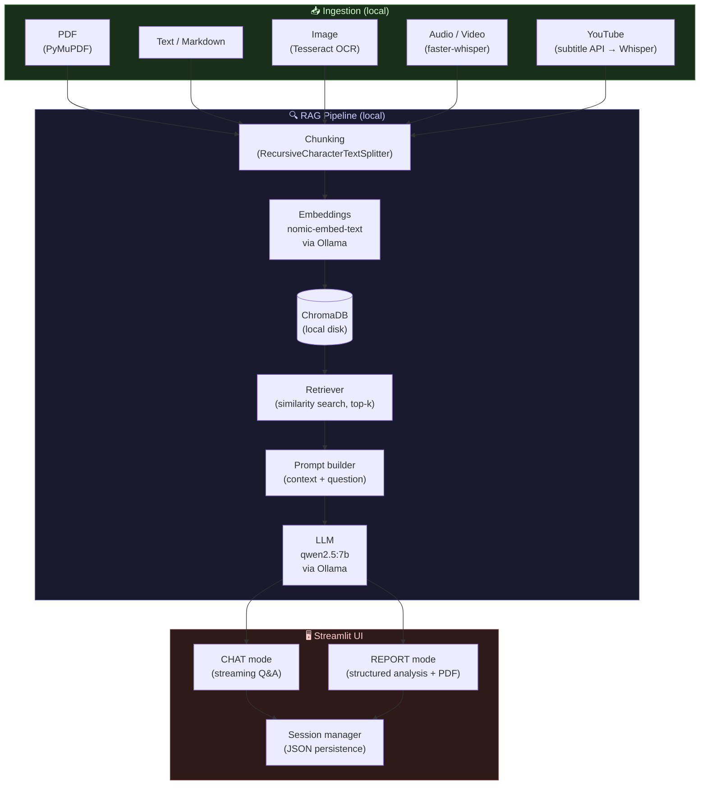
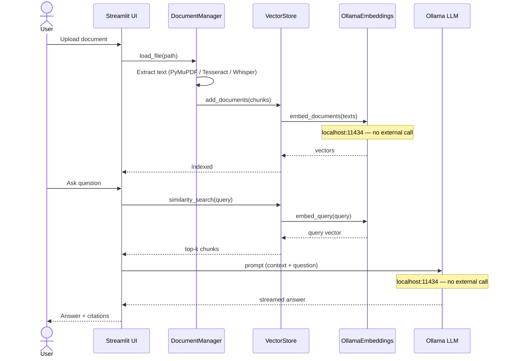
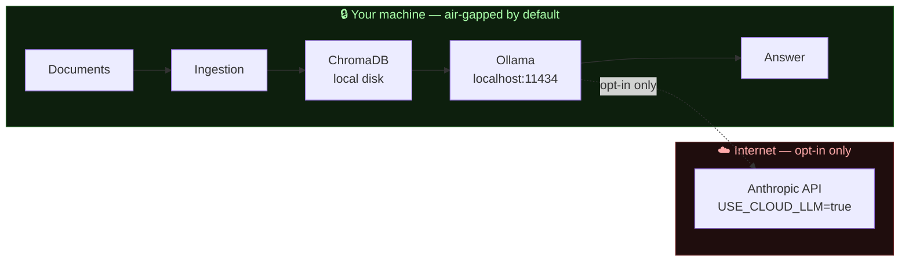

# Architecture

## System overview



## Data flow — no external transmission



## Module structure

```
src/localrag/
├── config.py                   # pydantic-settings: all tuneable parameters
├── ingestion/
│   ├── base.py                 # Loader Protocol, FileIndex, load_text_file
│   ├── pdf_loader.py           # PyMuPDF → Documents
│   ├── image_loader.py         # Tesseract OCR → Documents
│   ├── audio_loader.py         # faster-whisper → Documents
│   ├── youtube_loader.py       # transcript API + yt-dlp/Whisper fallback
│   └── manager.py              # DocumentManager: coordinates loaders + index
├── rag/
│   ├── chunking.py             # RecursiveCharacterTextSplitter wrapper
│   ├── embeddings.py           # EmbedderProtocol + OllamaEmbeddings factory
│   ├── llm.py                  # LLMProtocol + Ollama / Cloud LLM factory
│   ├── vectorstore.py          # VectorStore (ChromaDB wrapper)
│   ├── pipeline.py             # RAGPipeline: retrieve → prompt → generate
│   └── system.py               # RAGSystem: thin facade wiring all rag/ modules
├── session/
│   └── store.py                # SessionStore: JSON file per chat session
└── ui/
    └── app.py                  # Streamlit app: sidebar, CHAT mode, REPORT mode
```

## Privacy boundary



**When `USE_CLOUD_LLM=false` (default):** the dashed arrow does not exist.  
**Embeddings always stay local**, regardless of the `USE_CLOUD_LLM` setting.
